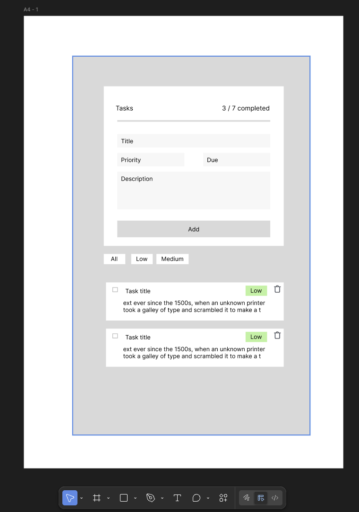

# Frontend Take-Home Assessment: Interactive Task Dashboard

## 🚀 How to Run Locally

1. Clone the repository  
2. Navigate to the project directory  
3. Run `npm install` to install dependencies  
4. Run `npm run dev` to start the development server  
5. Open your browser  

---

## 📝 Notes on Implementation

Due to time constraints, I opted for a **simple, responsive UI** that works across both desktop and mobile.  
The app is divided into two main sections:  
- **Task creation** (adding new tasks)  
- **Task list** (displaying existing tasks)  

Animations for adding tasks and marking them as completed were planned but not implemented because of limited time.

---

## ⏱️ Time Breakdown (Planned vs. Actual)

**Planning Phase (10 mins)**  
- Project/environment setup: ~5 mins  
- UI layout design: ~15 mins  

**Core Implementation (35 mins)**  
- Task creation functionality: ~45 mins  

**Review Phase (5 mins)**  
- Final review & adjustments: ~5 mins  

---

## ⚖️ Trade-offs

- Focused on **core functionality** and a basic UI due to time limits.  
- Layout is **minimal** and not optimised for larger screens.  
- Components are **basic and only partially reusable**, further refactoring would be needed.  
- Radix Dialog components were used with **minimal customization** to save time on styling.
- Unit tests were not implemented due to time constraints.
- Error handling and error boundary are **basic**, further refactoring would be needed. 

## 🚀 Deployment / Preview

- The application is deployed on **Vercel** and can be accessed [here](https://frontend-assessment-starter.vercel.app/).  
- A **Dockerfile** is also included for custom deployment. The app is deployed on my own server and available [here](https://task-dashboard.apphostcloud.link/). 